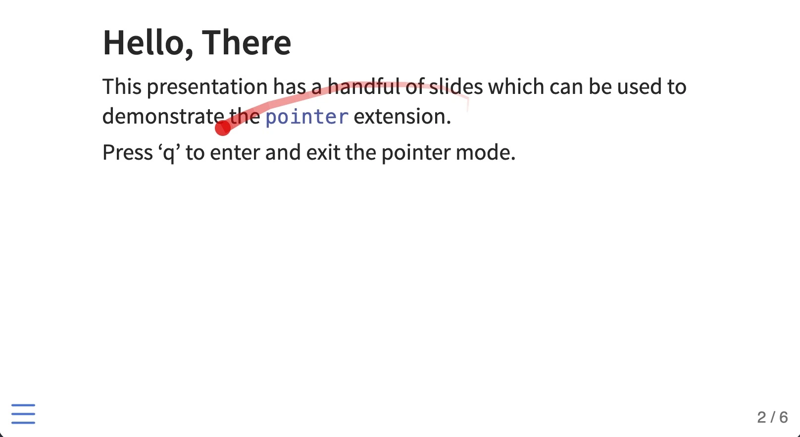

# pointer 

A Quarto revealjs plugin extension that adds a configurable presenter pointer with optional smooth trail rendering.

Requires Quarto >= 1.2.198.



## Installation

```bash
quarto add royfrancis/quarto-revealjs-pointer
```

The extension is installed into the `_extensions` directory and should be committed to version control for reproducible builds.

## Usage

Add the plugin and configure it in document metadata:

```yaml
title: "My Presentation"
format:
  revealjs:
    pointer:
      key: "q"
      color: "red"
      pointerSize: 16
      trail: false
revealjs-plugins:
  - pointer
```

When `alwaysVisible` is `false` (default), press `q` to toggle pointer mode.

## Options

| Option | Type | Default | Description |
| --- | --- | --- | --- |
| `key` | string | `"q"` | Key used to toggle pointer mode. Unsupported values fallback to `q`. |
| `color` | string | `"red"` | CSS color for pointer and trail. |
| `pointerSize` | number | `16` | Pointer diameter in pixels (number only). |
| `alwaysVisible` | boolean | `false` | Keep the pointer on screen without keyboard toggle. |
| `trail` | boolean | `false` | Draw a smooth tapered trail while moving. |
| `trailDuration` | number | `150` | Trail fade duration in milliseconds. |
| `trailSampling` | number | `2` | Pixel threshold before adding a new trail point. |
| `trailMaxPoints` | number | `80` | Maximum points retained for trail rendering. |

For examples, see [here](https://royfrancis.github.io/quarto-revealjs-pointer/).

## Acknowledgements

Built on [quarto-ext/pointer](https://github.com/quarto-ext/pointer)

---

2026 • Roy Francis
